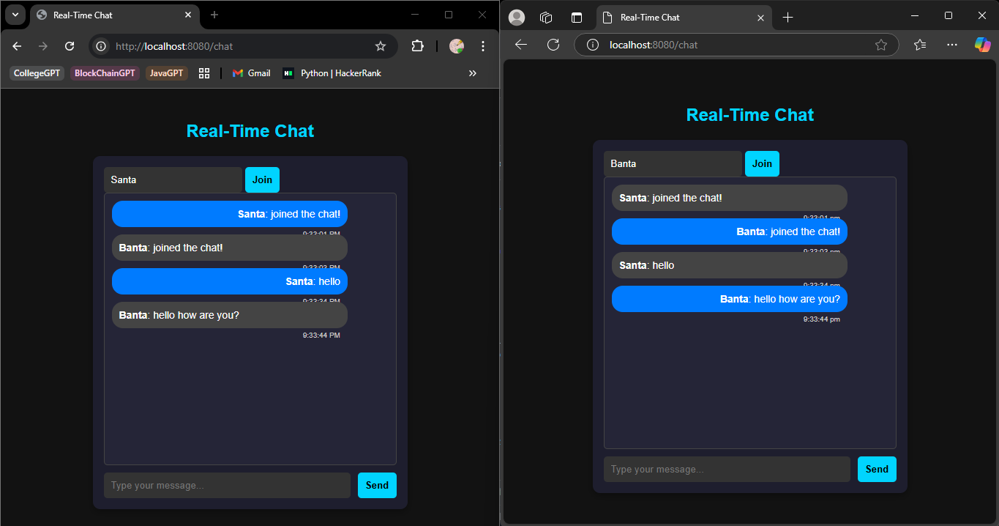

# Real-Time Chat Application (Spring Boot + WebSockets)

This is a simple real-time chat application built using Spring Boot, WebSockets, and STOMP for real-time communication between users.

## Features
- Real-time messaging using WebSockets
- Multiple users can chat simultaneously
- Simple and clean UI with Bootstrap
- Frontend: HTML, JavaScript, Bootstrap# 🚀 RelayTalk - Real-Time Chat Application

RelayTalk is a **real-time chat application** built with **Spring Boot**, **WebSockets**, and **Thymeleaf**. It allows multiple users to communicate in real-time without requiring a database.

---

## 📌 Features

### 🎯 **Core Functionalities**
✅ **Real-time messaging** with **WebSockets**  
✅ **No database required** – in-memory message handling  
✅ **Multi-user support** – multiple users can chat simultaneously  
✅ **Web-based UI** built with **Thymeleaf**  

### 🎨 **User Interface & Experience Enhancements**
✅ **Modern dark theme UI**  
✅ **Bubble-style chat layout** (sent messages on **right**, received messages on **left**)  
✅ **Auto-scroll for new messages**  
✅ **Timestamps** for each message  
✅ **Responsive design** – works on both **mobile & desktop**  

### 🛠 **Functional Enhancements**
✅ **Username support** – users must enter a name before joining  
✅ **Auto-disable input fields** until a user joins the chat  
✅ **Works across multiple browser windows**  

---

## 🛠 Installation & Setup

### **1️⃣ Clone the Repository**
```sh
git clone https://github.com/Shubham-Upadhyay17/RelayTalk.git
cd RelayTalk
```

### **2️⃣ Run the Spring Boot Application**
```sh
mvn spring-boot:run
```

The application will start at **http://localhost:8080**

### **3️⃣ Open in Browser**
- Open **http://localhost:8080/chat** in multiple browser windows to test real-time chat functionality.

---

## 📷 Screenshots

  

---

## 🛠 Tech Stack
- **Backend:** Spring Boot, WebSockets
- **Frontend:** Thymeleaf, HTML, CSS, JavaScript
- **Build Tool:** Maven

---

## 📌 Contributing
Feel free to fork the repository and submit pull requests with improvements!

---

## 📄 License
This project is open-source and available under the **MIT License**.

---

### 💬 Have Questions?
Feel free to reach out on **GitHub Discussions** or open an **issue**. 🚀


- Backend: Spring Boot, WebSocket, STOMP

## Project Structure
chat-app/
│── src/
│   ├── main/java/com/example/chat/
│   │   ├── config/            # WebSocket Configurations
│   │   ├── controller/        # Handles WebSocket Messages
│   │   ├── model/             # Message Model
│   │   ├── ChatApplication.java  # Main Spring Boot App
│   ├── main/resources/templates/
│   │   ├── chat.html          # Chat UI
│── pom.xml                    # Dependencies (Spring Boot, WebSockets)
│── README.md                  # Project Documentation

## How to Use
1. Open http://localhost:8080/chat in multiple browser tabs.
2. Enter your name and message.
3. Click "Send" to send the message.
4. Messages will appear in the chatbox in real-time.

## Technologies Used
- Spring Boot (Java) - Backend
- WebSockets + STOMP - Real-time communication
- SockJS + STOMP.js - WebSocket client-side handling
- HTML, JavaScript, Bootstrap - Frontend UI

## WebSocket Flow Diagram
Client ----(WebSocket)----> Spring Boot Server ----(Broadcast)----> Other Clients

1. User connects to WebSocket (/chat).
2. Messages are sent via STOMP to /app/sendMessage.
3. Server broadcasts the message to /topic/messages.
4. All connected users receive the message in real-time.

## Future Enhancements
- User authentication (Login system)
- Private chat rooms
- Message persistence (Save messages in database)
- Typing indicators

## License
This project is licensed under the MIT License.

Have suggestions or improvements? Feel free to contribute!
